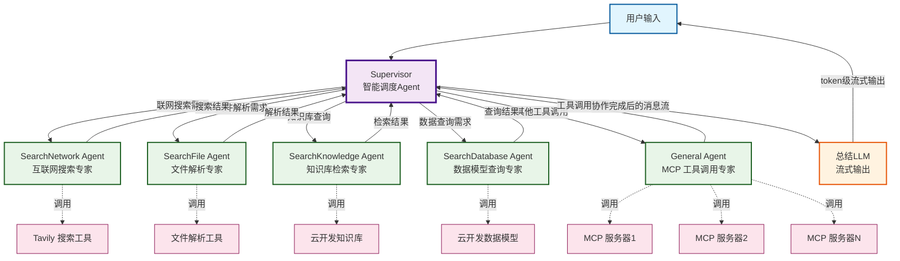

# LangGraph 多Agent协作 函数型智能体模板

## 项目简介

本项目是一个基于 [LangGraph](https://github.com/langchain-ai/langgraph) 框架的**多Agent协作智能体模板**。
采用 Supervisor 智能调度模式，支持多种专业 Agent 协作、流式输出和云开发 MCP Server 工具调用，适合构建复杂的 AI 助手、联网/知识库检索/数据库检索等场景。

### 🚀 核心特性

- **🧠 Supervisor 智能调度**：基于 `langgraph-supervisor` 自动分配任务给最合适的专业 Agent
- **👥 多专业 Agent 协作**：支持联网搜索、文件解析、知识库检索、数据查询、MCP 工具调用等
- **⚡ 流式输出优化**：总结 LLM token 级流式，提升用户体验
- **🔧 MCP 工具集成**：支持多 MCP 服务器，动态生成 Agent 能力描述
- **📝 配置化管理**：通过 YAML 配置文件灵活控制各功能模块的启用状态
- **🏗️ 函数型云托管**：基于云开发函数型云托管，支持弹性扩缩容

---

## 架构与流程说明

### 多Agent 协作架构



### 🔄 工作流程详解

1. **智能调度阶段**：
   - Supervisor 分析用户输入，判断需要哪些专业 Agent 参与
   - 根据关键词和上下文自动分配任务

2. **协作执行阶段**：
   - 各专业 Agent 并行或串行执行具体任务
   - 调用相应的工具获取信息和结果

3. **结果汇总阶段**：
   - Supervisor 收集所有 Agent 的执行结果
   - 整合成完整的消息流

4. **流式输出阶段**：
   - 总结 LLM 基于协作结果进行 token 级流式输出
   - 用户实时看到生成过程

---

## 专业 Agent 详解

### 🌐 SearchNetwork Agent - 云开发联网搜索专家
- **职责**：获取最新互联网信息、实时数据
- **工具**：联网搜索工具
- **触发场景**：用户询问"最新"、"现在"、"今天"、"实时"等关键词
- **适用场景**：新闻事件、股票价格、天气、体育赛事等

### 📄 SearchFile Agent - 云开发文件解析专家
- **职责**：解析各种文件格式（图片、文档、音频、视频等）
- **工具**：云开发文件解析工具
- **触发场景**：用户上传文件或询问文件相关问题
- **支持格式**：PDF、图片、音频、视频、表格等

### 📚 SearchKnowledge Agent - 云开发知识库检索专家
- **职责**：检索企业内部知识库、业务文档
- **工具**：云开发知识库检索
- **触发场景**：企业 FAQ、政策流程、技术规范等查询
- **数据源**：可配置多个知识库

### 🗄️ SearchDatabase Agent - 云开发数据模型检索专家
- **职责**：查询结构化业务数据
- **工具**：云开发数据模型检索
- **触发场景**：统计分析、历史记录、用户数据查询
- **数据源**：可配置多个数据模型

### 🔧 General Agent - MCP 工具专家
- **职责**：调用各种 MCP（Model Context Protocol）工具
- **工具**：动态加载的 MCP 服务器工具
- **特色功能**：
  - 动态生成 Agent 能力描述
  - 自动适配 MCP 工具为 LangChain StructuredTool
  - 支持多服务器多工具配置

---

## 配置文件说明

项目使用 `agent-config.yaml` 进行配置化管理：

```yaml
# Agent 基础信息
name: 智能小助手
model: deepseek-v3-function-call
agentSetting: 你什么都知道，无论用户问你什么问题，你都能输出长篇大论，滔滔不绝。

# 功能开关
searchNetworkEnable: true    # 启用联网搜索
searchFileEnable: true       # 启用文件解析
isNeedRecommend: true         # 启用推荐问题

# 数据源配置
knowledgeBase: ['your-knowledge-base-id']    # 知识库 ID 列表
databaseModel: ['your-database-model-id']    # 数据模型列表

# MCP 服务器配置
mcpServerList:
  - name: your-mcp-server-name      # 腾讯地图 MCP 服务
    url: https://${your-env}.api.tcloudbasegateway.com/v1/cloudrun/${your-mcp-server-name}/messages
    tools:
      - name: geocoder         # 地理编码
      - name: placeSearchNearby # 附近搜索
  - name: your-mcp-server-name             # 云开发 MCP 服务
    url: https://${your-env}.api.tcloudbasegateway.com/v1/cloudrun/${your-mcp-server-name}/messages
    tools:
      - name: listEnvs        # 列举环境
```

---

## 环境变量配置

创建 `.env.development` 文件进行本地开发配置：

```bash
# === 必需配置 ===
CLOUDBASE_ENV_ID=your-env-id                    # 云开发环境 ID
CLOUDBASE_API_KEY=your-api-key                  # 云开发 API Key

> **部署说明**：部署到线上时，可通过云开发控制台配置环境变量。
```

---

## 快速开始

### 1. 依赖安装

```bash
pnpm install
```

### 2. 配置文件设置

1. 复制 `agent-config.yaml` 并根据需求修改配置
2. 创建 `.env.development` 文件并配置环境变量

### 3. 本地开发

```bash
# 启动本地开发服务
pnpm run dev
```

### 4. 如何调用  Agent 服务

调用云托管部署的 Agent 服务：

```sh
curl --location 'http://{envID}.api.tcloudbasegateway.com/v1/aibot/bots/{botID}/send-message'  \
--header 'Accept: text/event-stream' \
--header 'Content-Type: application/json' \
--header 'Authorization: Bearer <token>' \
--data '{
    "msg": "今日天气",
    "searchEnable": true
}'
```

调用本地 Agent 服务：

```sh
curl --location 'http://{envID}.api.tcloudbasegateway.com/v1/aibot/bots/{botID}/send-message' --connect-to '{envId}.api.tcloudbasegateway.com:80:127.0.0.1:3000'  \
--header 'Accept: text/event-stream' \
--header 'Content-Type: application/json' \
--header 'Authorization: Bearer <token>' \
--data '{
    "msg": "今日深圳天气",
    "searchEnable": true
}'
```

通过 `--connect-to` 参数可以将请求转发到本地 Agent 服务。

参数说明：

* `{envID}`：云开发环境 ID
* `{botID}`：Agent 智能体 ID，本地开发时可以任意指定

### 5. 部署上线

```bash
# 构建项目
pnpm run build

# 部署到云开发
pnpm run deploy
```

---

### 🔌 MCP 服务器集成

**配置 MCP 服务器**：
```yaml
mcpServerList:
  - tools:
      - name: 'your-mcp-server1-tool1-name'
      - name: 'your-mcp-server1-tool2-name'
    url: https://{your-envId}.api.tcloudbasegateway.com/v1/cloudrun/{your-mcp-server1-name}/messages
    name: 'your-mcp-server1-name'
```


---

## 项目结构

```
langgraph-agent/
├── src/
│   ├── bot.ts                    # 核心 Bot 类，多 Agent 协作逻辑
│   ├── bot_config.ts            # 配置管理
│   ├── generalAgent.ts          # 通用 Agent (MCP 工具调用)
│   ├── chat_tool.service.ts     # 工具服务集成
│   ├── mcp.ts                   # MCP 客户端管理
│   └── util.ts                  # 工具函数
├── agent-config.yaml            # Agent 配置文件
├── package.json                 # 项目依赖
├── tsconfig.json               # TypeScript 配置
└── README.md                   # 项目文档
```

---

## 参考文档

- [LangGraph 官方文档](https://langchain-ai.github.io/langgraphjs/)
- [LangGraph Supervisor](https://langchain-ai.github.io/langgraphjs/how-tos/supervision/)
- [腾讯云开发 AI+](https://docs.cloudbase.net/ai/introduce)
- [函数型云托管](https://docs.cloudbase.net/cbrf/intro)
- [Model Context Protocol](https://modelcontextprotocol.io/)

---

## 技术栈

| 技术 | 版本 | 说明 |
|------|------|------|
| LangGraph | 0.3.1+ | 多 Agent 协作框架 |
| LangGraph Supervisor | 0.0.13+ | 智能调度器 |
| LangChain | 0.3.27+ | LLM 应用开发框架 |
| 云开发 | - | 部署平台 |

---

## License

MIT License